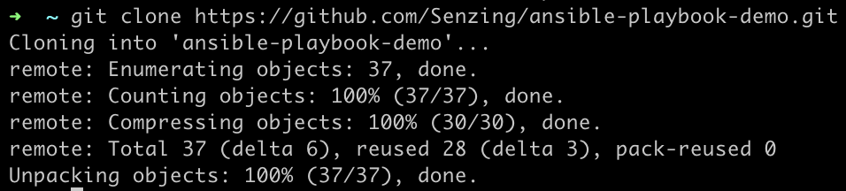

# How to setup Ansible Playbooks

To illustrate the power of Ansible playbooks and Ansible Galaxy, this demo will show you how Ansible Playbooks can be setup in 3 easy steps. This demo will use [ansible demo playbook](https://github.com/Senzing/ansible-playbook-demo) which is used to setup the Senzing environment.

1. Download the Ansible playbook
1. Place into packer-ansible folder
1. Update custom-var.json

## Download the Ansible playbook

Firstly, clone the repository.



## Place into packer-ansible folder

Copy the main.yml and requirements.yml file to the packer-ansible folder.


## Update custom-var.json

Lastly, update custom-var.json with the new files. For this particular playbook, you would need to accept Senzing's EULA by going [here](https://github.com/Senzing/knowledge-base/blob/master/lists/environment-variables.md#senzing_accept_eula) and replacing the placeholder with the EULA code.

```json
{
  "ansible_galaxy_file": "requirements.yml",
  "ansible_playbook_file": "playbook.yml",
  "ansible_version": "2.9.6",
  "senzing_accept_eula": "<insert Senzing EULA code>"
}
```


Now you are ready to create an image that has been configured with an ansible playbook. On how to build images, do refer to our [centos](https://github.com/Senzing/packer-ansible/tree/issue-4.chia#build-using-template-centos), [debian](https://github.com/Senzing/packer-ansible/tree/issue-4.chia#build-using-template-debian) and [ubuntu](https://github.com/Senzing/packer-ansible/tree/issue-4.chia#build-using-template-ubuntu) guide.
